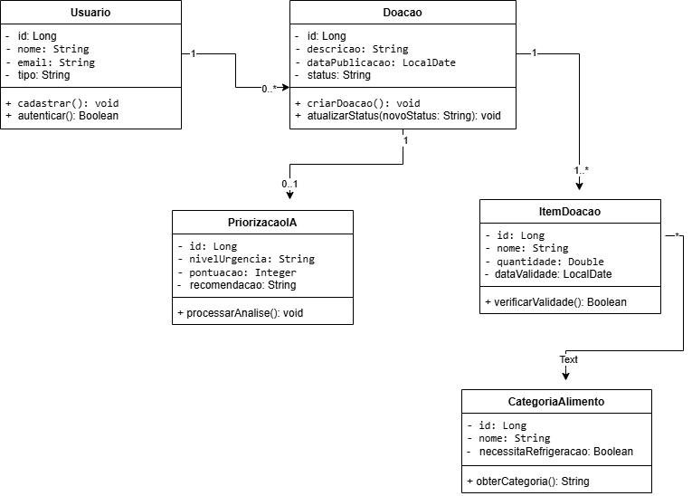
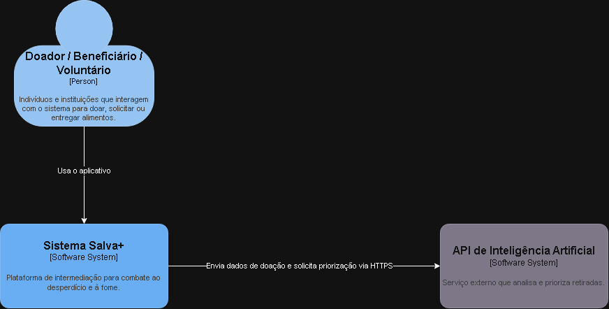
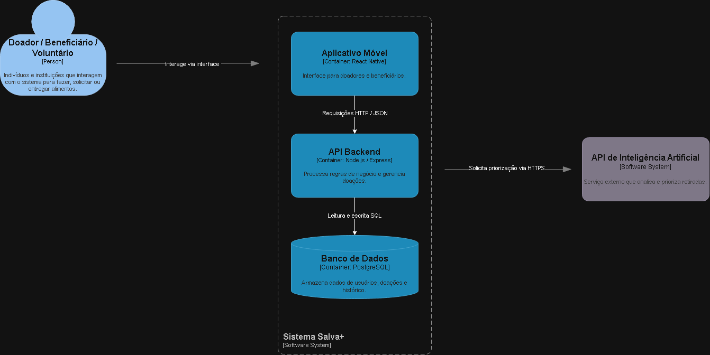

# Salva+

## ODS Escolhida

Nosso projeto será desenvolvido com base na **ODS 2 — Fome Zero e Agricultura Sustentável**.

O **Salva+** tem como objetivo combater o desperdício de alimentos e contribuir para a redução da fome, facilitando o acesso a alimentos que ainda estão próprios para consumo.

---

## O Problema Real

Restaurantes, mercados, padarias e outros estabelecimentos alimentícios frequentemente possuem alimentos excedentes que não serão mais comercializados ou que estão próximos da data de validade, mas que ainda podem estar próprios para o consumo.

Muitos desses alimentos acabam sendo descartados, contribuindo para o desperdício.

Ao mesmo tempo, existem pessoas e famílias em situação de vulnerabilidade que enfrentam dificuldades para ter acesso a uma alimentação adequada.

O problema está na falta de uma conexão eficiente entre os estabelecimentos que possuem alimentos disponíveis e as pessoas ou instituições que precisam desses alimentos.

---

## A Solução

O **Salva+** será uma plataforma que conecta estabelecimentos que possuem alimentos excedentes a **pessoas e instituições que precisam desses alimentos**.

Por meio da plataforma, um estabelecimento poderá cadastrar uma doação informando dados como:

* Tipo de alimento;
* Quantidade disponível;
* Prazo para retirada;
* Localização;
* Informações relevantes sobre a doação.

Pessoas em situação de vulnerabilidade e instituições sociais poderão visualizar as doações disponíveis e realizar uma **solicitação de retirada**.

Dessa forma, alimentos que poderiam ser descartados poderão ser destinados a quem realmente precisa.

---

## Uso da Inteligência Artificial

A **Inteligência Artificial** será utilizada como um diferencial do Salva+.

O sistema poderá analisar informações das doações para auxiliar na **priorização das retiradas**, considerando fatores como:

* Prazo para retirada;
* Quantidade de alimentos;
* Localização da doação;
* Urgência da retirada.

Com essas informações, a IA poderá ajudar o sistema a identificar quais doações precisam de maior prioridade, contribuindo para que os alimentos sejam retirados antes que percam sua validade.

---

## Público-Alvo

O projeto será destinado principalmente a:

* Restaurantes;
* Mercados;
* Padarias;
* Outros estabelecimentos alimentícios;
* Instituições sociais;
* ONGs;
* Pessoas em situação de vulnerabilidade;
* Famílias que necessitam de alimentos.

---

## Objetivo do Projeto

O **Salva+** tem como objetivo reduzir o desperdício de alimentos e contribuir para o combate à fome, criando uma conexão entre estabelecimentos que possuem alimentos excedentes e pessoas ou instituições que possam destiná-los a quem precisa.

---

## Funcionamento do Sistema

O funcionamento básico do Salva+ será baseado no seguinte fluxo:

**Estabelecimento → Doação → Salva+ → Retirada → Pessoa ou Instituição**

O estabelecimento cadastra os alimentos disponíveis, o sistema disponibiliza a doação e uma pessoa ou instituição pode realizar a retirada.

A plataforma também manterá o registro das doações e retiradas realizadas, permitindo acompanhar o impacto gerado pelo projeto.

---

## Principais Classes

A modelagem inicial do Salva+ é composta pelas seguintes classes:

* **Usuário**
* **Estabelecimento**
* **Instituição**
* **Alimento**
* **Doação**
* **Retirada**

Essas classes representam os principais elementos envolvidos no funcionamento da plataforma.

---

## Impacto Esperado

Com o desenvolvimento do **Salva+**, esperamos:

* Reduzir o desperdício de alimentos;
* Aumentar o aproveitamento de alimentos próprios para consumo;
* Contribuir para o combate à fome;
* Facilitar o acesso a alimentos para pessoas em situação de vulnerabilidade;
* Facilitar a conexão entre estabelecimentos e instituições;
* Organizar o processo de doação e retirada;
* Gerar informações sobre a quantidade de alimentos aproveitados e o impacto das doações.

## 📐 Modelagem e Arquitetura

### 1. Diagrama de Classes (POO)
Abaixo está a representação do modelo de domínio da aplicação **Salva+**, demonstrando as entidades, atributos, métodos e relacionamentos:

#### Explicação das Entidades e Relacionamentos:
* **Usuario:** Representa os doadores e beneficiários do sistema. Um usuário pode registrar de zero a várias doações (`1` para `0..*`).
* **Doacao:** Contém as informações da oferta de mantimentos. Cada doação pertence a exatamente um usuário e possui um lote com pelo menos um item (`1` para `1..*`).
* **ItemDoacao:** Detalha cada produto doado (quantidade e data de validade). Cada item está associado obrigatoriamente a uma única categoria de alimento (`*` para `1`).
* **CategoriaAlimento:** Classifica os alimentos (ex: perecíveis, não perecíveis) e indica a necessidade de refrigeração.
* **PriorizacaoIA:** Mapeia a análise gerada pela IA, atribuindo nota de urgência e recomendações de resgate para a doação (`1` para `0..1`).

# 📌 Arquitetura do Sistema Salva+ (Modelo C4)

Este documento apresenta a documentação arquitetural do projeto **Salva+**, utilizando o **Modelo C4** para detalhar a visão geral do sistema e seus componentes internos.

---

## 🖼️ Nível 1: Diagrama de Contexto (Context)

O diagrama de contexto apresenta o **Sistema Salva+** em um alto nível de abstração, destacando seus usuários (atores) e as integrações com sistemas externos.

### **Componentes:**
* **Usuários (Doador / Beneficiário / Voluntário):** Pessoas e instituições que utilizam a plataforma para cadastrar, solicitar ou realizar a entrega de doações de alimentos.
* **Sistema Salva+:** A plataforma central responsável por intermediar todo o processo de redução do desperdício de alimentos.
* **API de Inteligência Artificial:** Serviço externo que analisa os dados das doações para calcular a prioridade de recolhimento e entrega.

---

## 🖼️ Nível 2: Diagrama de Contêineres (Containers)

O diagrama de contêineres faz um "zoom" no **Sistema Salva+**, detalhando as tecnologias escolhidas e como as aplicações se comunicam internamente.

### **Contêineres Internos:**
* **Aplicativo Móvel (`React Native`):** Interface de usuário onde doadores e beneficiários realizam o cadastro, visualizam ofertas e acompanham solicitações.
* **Backend da API ( Java / Spring Boot ):** Servidor principal que processa as regras de negócio, gerencia as autenticações e orquestra os dados da aplicação.
* **Banco de Dados (`PostgreSQL`):** Banco de dados relacional encarregado de armazenar o histórico de doações, perfis de usuários e logs da plataforma.

### **Comunicação entre Componentes:**
1. O **Usuário** interage com o **Aplicativo Móvel**.
2. O **Aplicativo Móvel** envia requisições `HTTP/JSON` para o **Backend da API**.
3. O **Backend da API** executa leituras e escritas via `SQL` no **Banco de Dados PostgreSQL**.
4. O **Backend da API** consulta a **API de IA** externa via `HTTPS` para obter cálculos de priorização de entregas.

